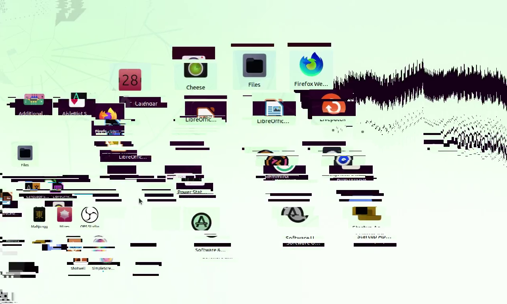

# ü.exe

	
	

ü.exe is a GDI software that creates flashy screen effects.

## License
This project is licensed with AGPL-3.0. If you use the code in this project, then your project must be open source.

Source code used: [Monoxide](https://github.com/whypet/Monoxide)

Also check out [Hydrogen.exe](https://github.com/LeoLezury/Hydrogen) here, created by LeoLezury.
